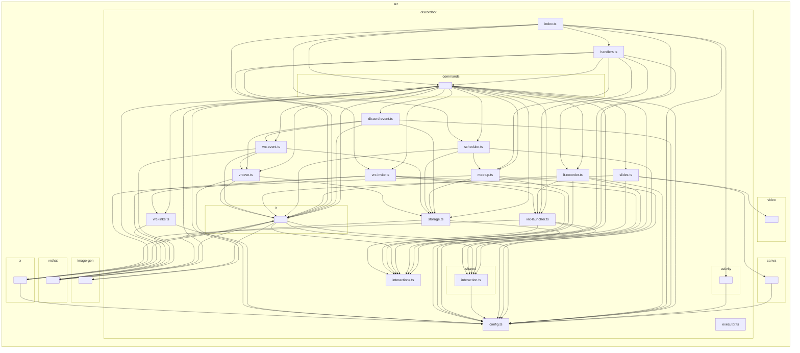

# 依存関係の図

`npm run deps:graph` で作り直す（手で書き換えない）。矢印は「import している → されている」。
フォルダーの枠だけのもの（lt・commands など）は、中のファイルを 1 つにまとめている。

```mermaid
flowchart LR

subgraph 0["src"]
subgraph 1["canva"]
2[" "]
end
subgraph 3["discordbot"]
subgraph 4["activity"]
5[" "]
end
subgraph 6["commands"]
7[" "]
end
8["config.ts"]
9["discord-event.ts"]
A["executor.ts"]
B["handlers.ts"]
C["index.ts"]
D["interactions.ts"]
E["lt-recorder.ts"]
subgraph F["lt"]
G[" "]
end
H["meetup.ts"]
I["scheduler.ts"]
subgraph J["shared"]
K["interaction.ts"]
end
L["slides.ts"]
M["storage.ts"]
N["vrc-event.ts"]
O["vrc-invite.ts"]
P["vrc-launcher.ts"]
Q["vrc-links.ts"]
R["vrceve.ts"]
end
subgraph S["image-gen"]
T[" "]
end
subgraph U["video"]
V[" "]
end
subgraph W["vrchat"]
X[" "]
end
subgraph Y["x"]
Z[" "]
end
end
2-->8
5-->8
7-->8
7-->K
7-->9
7-->H
7-->I
7-->L
7-->M
7-->N
7-->R
7-->X
7-->E
7-->O
7-->P
7-->Q
7-->T
7-->Z
7-->D
7-->G
9-->8
9-->G
9-->M
9-->N
9-->R
B-->7
B-->D
B-->E
B-->G
B-->H
B-->O
B-->P
C-->5
C-->7
C-->8
C-->B
C-->D
C-->G
C-->I
E-->8
E-->D
E-->G
E-->K
E-->P
G-->8
G-->X
G-->Z
G-->D
G-->K
G-->T
H-->Z
H-->8
H-->D
H-->M
I-->8
I-->G
I-->H
I-->M
K-->8
L-->2
L-->V
L-->8
L-->G
M-->X
M-->8
N-->X
N-->G
N-->M
N-->R
O-->X
O-->D
O-->K
O-->P
O-->Q
P-->X
P-->8
P-->D
P-->K
Q-->X
Q-->8
R-->8
R-->G
R-->M
Z-->8
Z-->G
```
