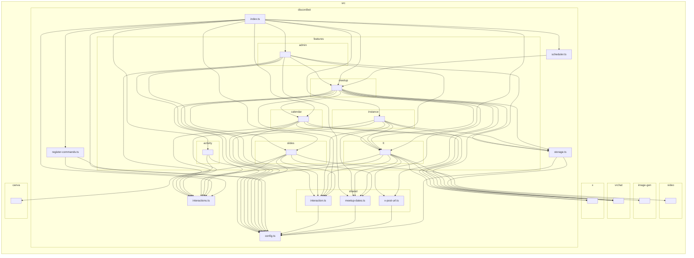

# 依存関係の図

`npm run deps:graph` で作り直す（手で書き換えない）。矢印は「import している → されている」。
フォルダーの枠だけのもの（features の各機能・vrchat など）は、中のファイルを 1 つにまとめている。

```mermaid
flowchart LR

subgraph 0["src"]
subgraph 1["canva"]
2[" "]
end
subgraph 3["discordbot"]
4["config.ts"]
subgraph 5["features"]
subgraph 6["activity"]
7[" "]
end
subgraph 8["admin"]
9[" "]
end
subgraph A["calendar"]
B[" "]
end
subgraph C["instance"]
D[" "]
end
subgraph E["lt"]
F[" "]
end
subgraph G["meetup"]
H[" "]
end
subgraph I["slides"]
J[" "]
end
end
K["index.ts"]
L["interactions.ts"]
M["register-commands.ts"]
N["scheduler.ts"]
subgraph O["shared"]
P["interaction.ts"]
Q["meetup-dates.ts"]
R["x-post-url.ts"]
end
S["storage.ts"]
end
subgraph T["image-gen"]
U[" "]
end
subgraph V["video"]
W[" "]
end
subgraph X["vrchat"]
Y[" "]
end
subgraph Z["x"]
10[" "]
end
end
7-->4
7-->L
9-->4
9-->P
9-->Q
9-->S
9-->F
9-->H
9-->L
B-->4
B-->S
B-->F
B-->Y
B-->L
B-->P
D-->Y
D-->4
D-->P
D-->S
D-->L
D-->Q
D-->F
F-->Y
F-->10
F-->4
F-->R
F-->Q
F-->P
F-->L
F-->U
H-->L
H-->4
H-->P
H-->S
H-->B
H-->J
H-->10
H-->Q
H-->R
H-->F
H-->Y
J-->L
J-->P
J-->2
J-->W
J-->4
J-->Q
K-->4
K-->7
K-->9
K-->B
K-->D
K-->F
K-->H
K-->J
K-->L
K-->M
K-->N
M-->4
M-->L
N-->H
P-->4
Q-->4
R-->4
S-->Y
S-->4
```
