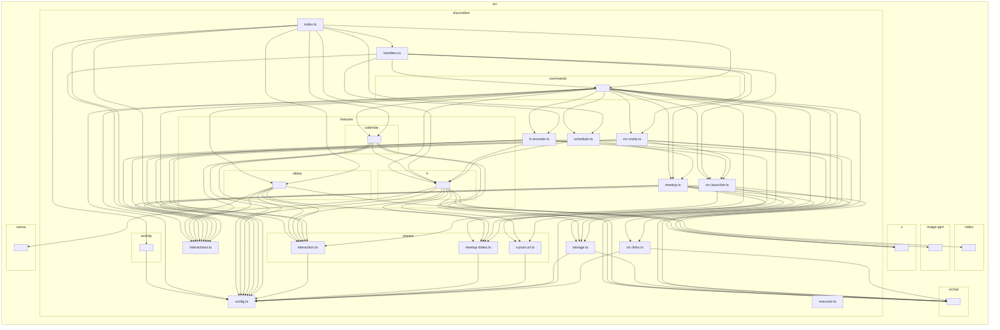

# 依存関係の図

`npm run deps:graph` で作り直す（手で書き換えない）。矢印は「import している → されている」。
フォルダーの枠だけのもの（features の各機能・commands など）は、中のファイルを 1 つにまとめている。

```mermaid
flowchart LR

subgraph 0["src"]
subgraph 1["canva"]
2[" "]
end
subgraph 3["discordbot"]
subgraph 4["activity"]
5[" "]
end
subgraph 6["commands"]
7[" "]
end
8["config.ts"]
9["executor.ts"]
subgraph A["features"]
subgraph B["calendar"]
C[" "]
end
subgraph D["lt"]
E[" "]
end
subgraph F["slides"]
G[" "]
end
end
H["handlers.ts"]
I["index.ts"]
J["interactions.ts"]
K["lt-recorder.ts"]
L["meetup.ts"]
M["scheduler.ts"]
subgraph N["shared"]
O["interaction.ts"]
P["meetup-dates.ts"]
Q["x-post-url.ts"]
end
R["storage.ts"]
S["vrc-invite.ts"]
T["vrc-launcher.ts"]
U["vrc-links.ts"]
end
subgraph V["image-gen"]
W[" "]
end
subgraph X["video"]
Y[" "]
end
subgraph Z["vrchat"]
10[" "]
end
subgraph 11["x"]
12[" "]
end
end
5-->8
7-->8
7-->O
7-->C
7-->G
7-->L
7-->M
7-->R
7-->10
7-->K
7-->S
7-->T
7-->U
7-->J
7-->12
7-->E
7-->P
7-->Q
C-->8
C-->R
C-->E
C-->10
C-->J
C-->O
E-->10
E-->12
E-->8
E-->Q
E-->P
E-->J
E-->W
E-->O
G-->J
G-->O
G-->2
G-->Y
G-->8
G-->P
H-->7
H-->J
H-->K
H-->L
H-->S
H-->T
I-->5
I-->7
I-->8
I-->C
I-->E
I-->G
I-->H
I-->J
I-->M
K-->8
K-->E
K-->J
K-->O
K-->P
K-->T
L-->12
L-->8
L-->J
L-->P
L-->Q
L-->R
M-->8
M-->E
M-->L
M-->R
O-->8
P-->8
Q-->8
R-->10
R-->8
S-->10
S-->J
S-->O
S-->T
S-->U
T-->10
T-->8
T-->J
T-->O
U-->10
U-->8
```
